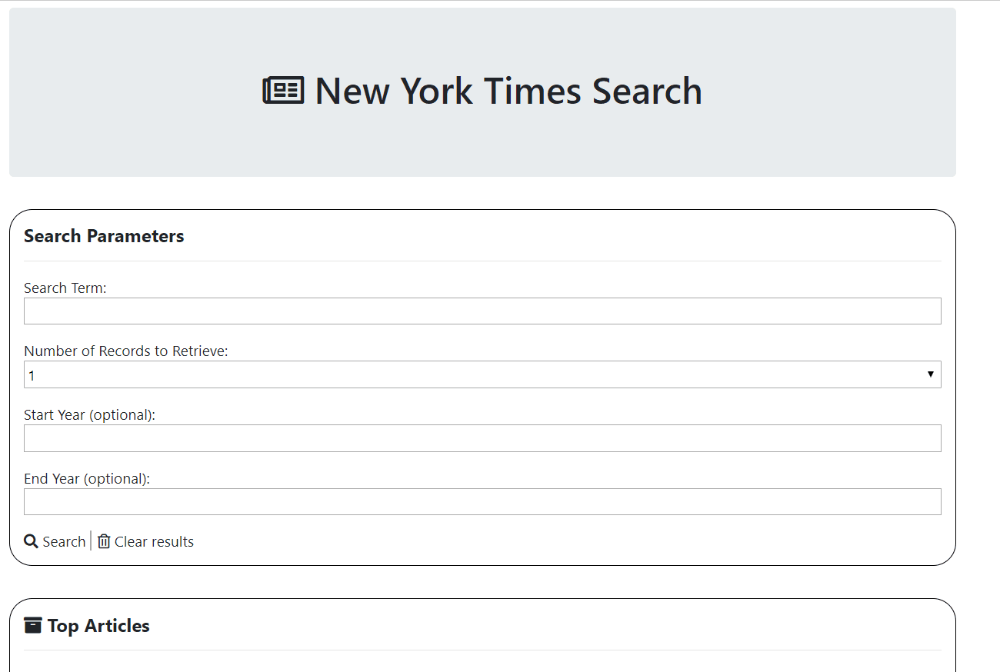

# Article-Search

This web page uses the New York Times API to request and retrieve articles.
Created with HTML, CSS, JavaScript, and JQuery.

How to use:
* In the search box, enter a keyword for articles of interest
* As an option, you can enter the start and end years to specify article dates.
* Be sure to select how many articles you'd like to pull and click on "search"
* In the "Top Articles" section, the article titles will appear in order of relevance as well as their author, section, publishing date, and url.
* Use "clear results" to clear out the articles.
